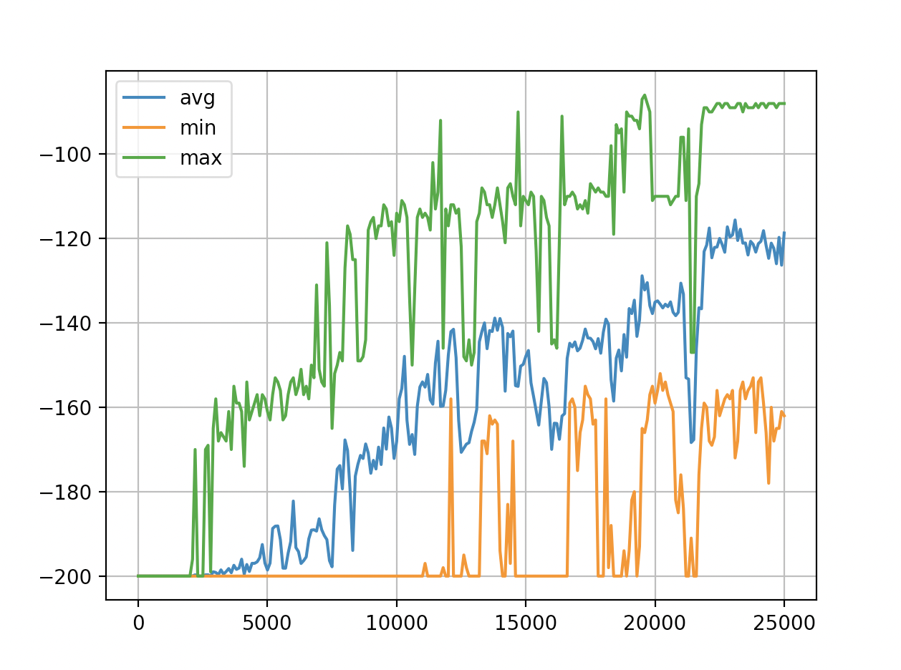
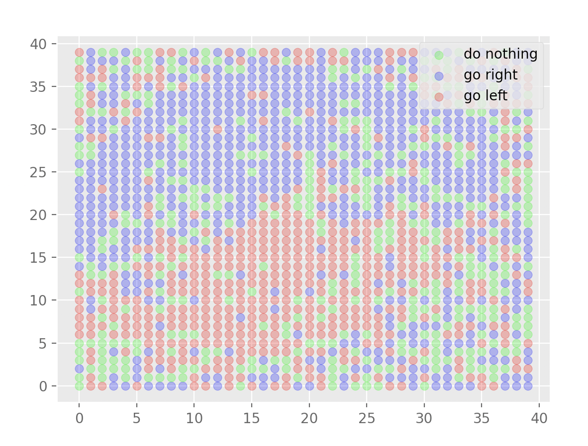

Mountain Car
Q-learning algorithm for the MountainCar-v0 environment by OpenAI. See: https://gym.openai.com/envs/MountainCar-v0/

The graph _rewards-trend_ shows the trend in average rewards, minimum rewards and maximum rewards when the algorithm is run for 25000 episodes.

The graph _action-choice_ shows the action with the highest q-value under specific a specific state in the environment. This graph would correspond to a q-table computed at a specific episode.

